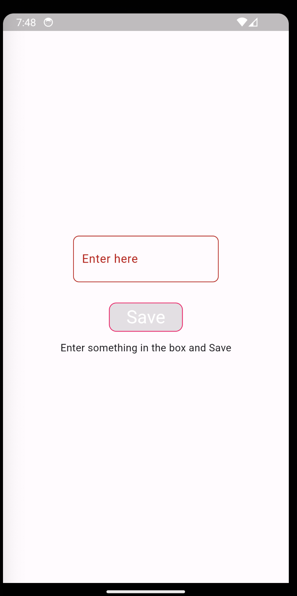
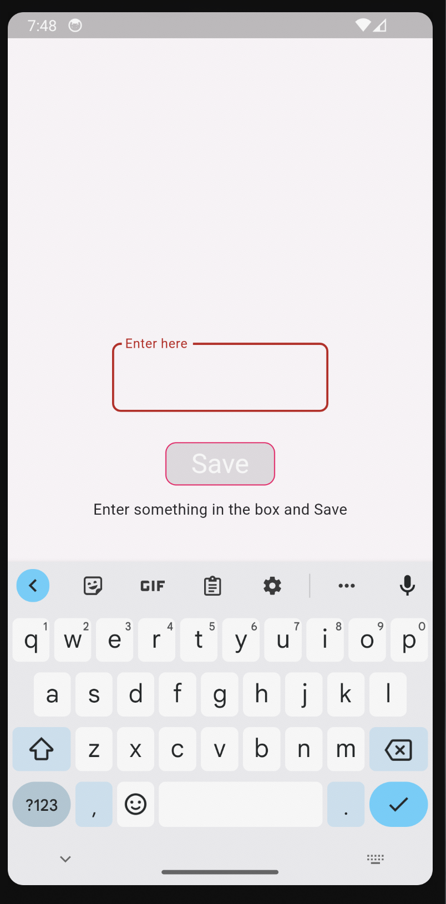
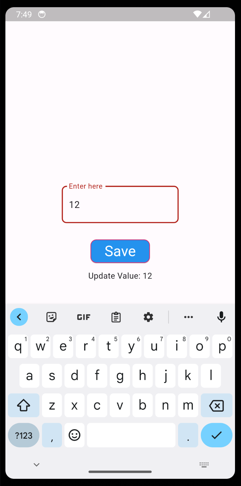
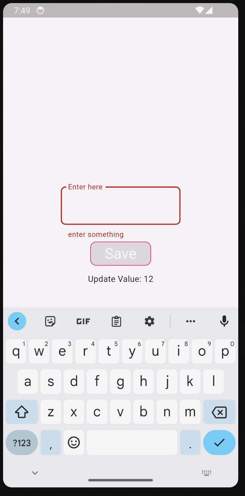
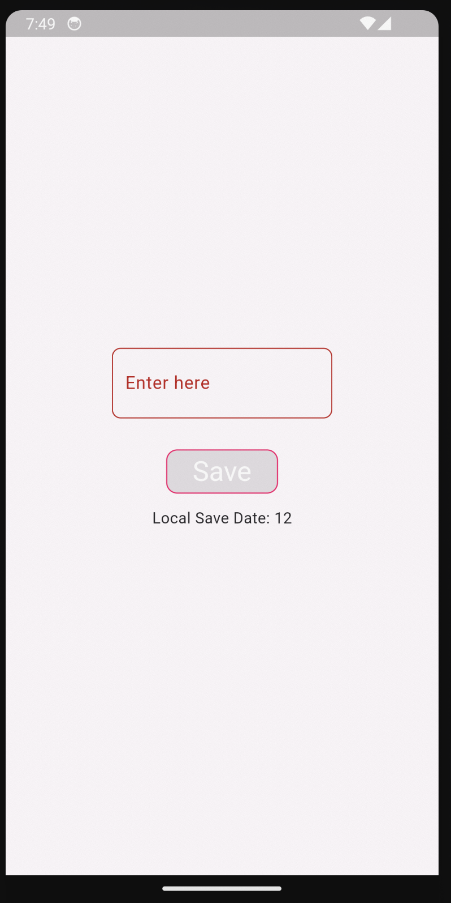

# shared_prefence_example

A new Flutter project.

## Getting Started

Things covered:

1. Overlapping problem in scaffold solved by resizeToAvoidBottomInset: false,

2. proper error code in textField

3. Local data save and Update data in when data change

4. In start up different message for user understanding.

5. Try out commonly used property of textfield and elevatedbutton

Start UP (1/5)

Tap on TextField(2/5)

Value entered and Saved(3/5)

TextField Cleared (4/5)

App Killed and started

